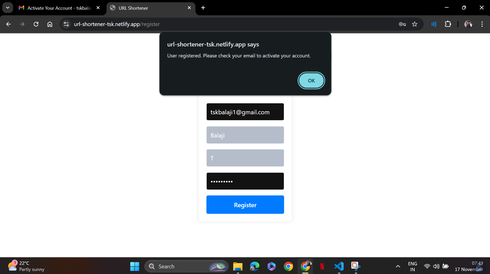
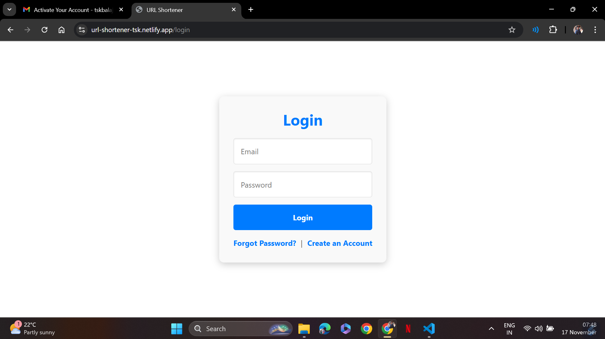
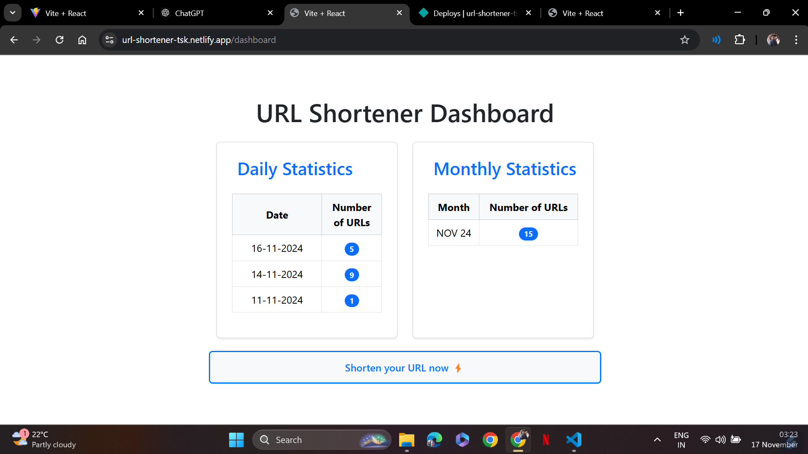
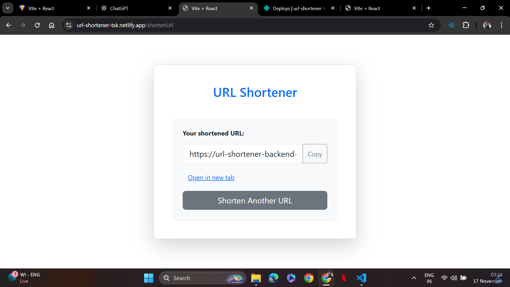

# URL Shortener Frontend

This is the frontend of a **URL Shortener Application** built with React and Bootstrap. It allows users to create short URLs, manage their existing URLs, and authenticate their accounts with login and signup features.

## Features

## User Authentication

  &nbsp;

- **Signup with email activation.**

    &nbsp;

  

- **Mail Content**

  

- **Activation**

  

- **Login with email and password.**

  

  &nbsp;

  &nbsp;

- **Forgot Password and Reset Password flows.**

  &nbsp;

  

  Link will be sent to your mail similar to activate and once clicked on it will redirect to the below Reset Password page.

  

&nbsp;

## URL Management

&nbsp;

- **Track URL clicks and display analytics.**

&nbsp;

**Click on the "Shorten Your URL now" to Create short URLs from long URLs.**

&nbsp;

&nbsp;

- Redirect users to the original URL when they visit the short URL.

- **Responsive Design**:
  - Built using **React** and **Bootstrap**, ensuring a user-friendly experience on both desktop and mobile devices.

---
